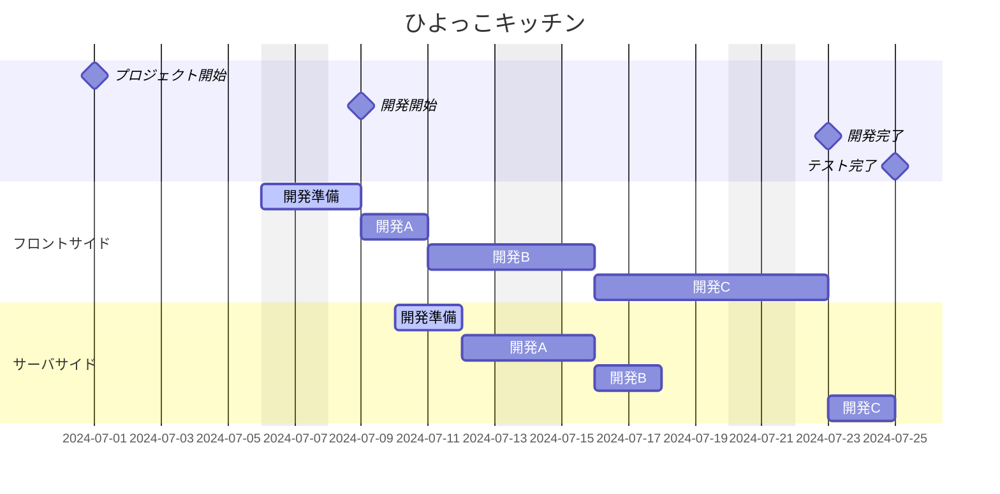

日程

```mermaid
gantt
    title ひよっこキッチン
    dateFormat  MM-DD
    excludes    weekends

    section  
        プロジェクト開始 : milestone, m1, 2024-07-01, 0d
        開発開始 : milestone, m2, after a1, 0d
        開発完了 : milestone, m3, after a4, 0d
        テスト完了 : milestone, m3, after b4, 0d

    section フロントサイド
        開発準備 :active,a1, 2024-07-06, 2d
        開発A :a2, after a1, 2d
        開発B :a3, after a2, 3d
        開発C :a4, after a3, 5d
        
    section サーバサイド
        開発準備 :active, b1, 2024-07-10  , 2d
        開発A :b2, after a2 b1  , 2d
        開発B :b3, after a3 b2  , 2d
        開発C :b4, after a4 b3  , 2d
```