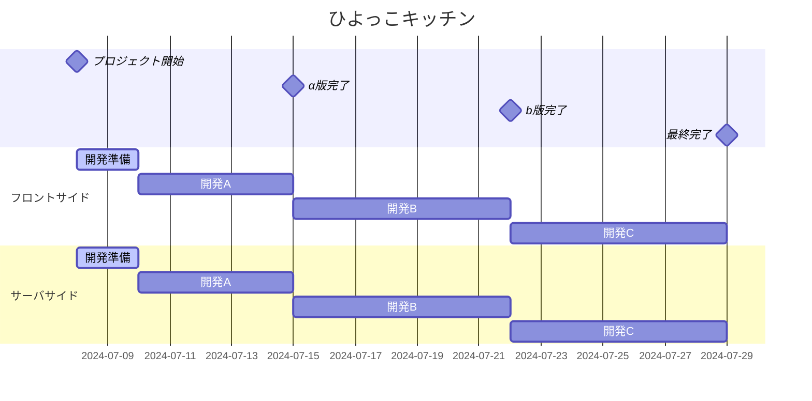

# プロジェクト"ひよっこキッチン"

作成日時が決まり次第修正

## 日程

```mermaid
gantt
    title ひよっこキッチン
    dateFormat  MM-DD

    section  
        プロジェクト開始 : milestone, m1, 2024-07-08, 0d
        α版完了 : milestone, m2, after a2 b2, 0d
        b版完了 : milestone, m3, after a3 b3, 0d
        最終完了 : milestone, m3, after a4 b4, 0d

    section フロントサイド
        開発準備 :active,a1, 2024-07-08, 2d
        開発A :a2, after a1, 5d
        開発B :a3, after a2, 7d
        開発C :a4, after a3, 7d
        
    section サーバサイド
        開発準備 :active, b1, 2024-07-08  , 2d
        開発A :b2, after b1  , 5d
        開発B :b3, after b2  , 7d
        開発C :b4, after b3  , 7d
```

## 更新履歴
- (記録例)07-07: フロントエンド 開発0　完了

