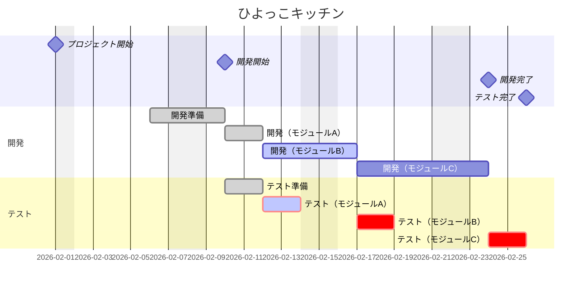

日程

```mermaid
gantt
    title ひよっこキッチン
    dateFormat  MM-DD
    excludes    weekends

    section  
        プロジェクト開始 : milestone, m1, 02-01, 0d
        開発開始 : milestone, m2, after a1, 0d
        開発完了 : milestone, m3, after a4, 0d
        テスト完了 : milestone, m3, after b4, 0d

    section 開発
        開発準備 :done,a1, 02-06, 2d
        開発（モジュールA） :done,a2, after a1, 2d
        開発（モジュールB） :active, a3, after a2, 3d
        開発（モジュールC） :a4, after a3, 5d
    section テスト
        テスト準備 :done, b1, 02-10  , 2d
        テスト（モジュールA） :crit, active, b2, after a2 b1  , 2d
        テスト（モジュールB） :crit, b3, after a3 b2  , 2d
        テスト（モジュールC） :crit, b4, after a4 b3  , 2d
```